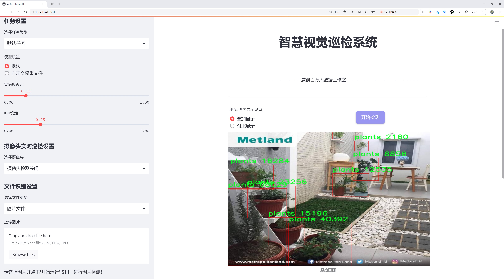
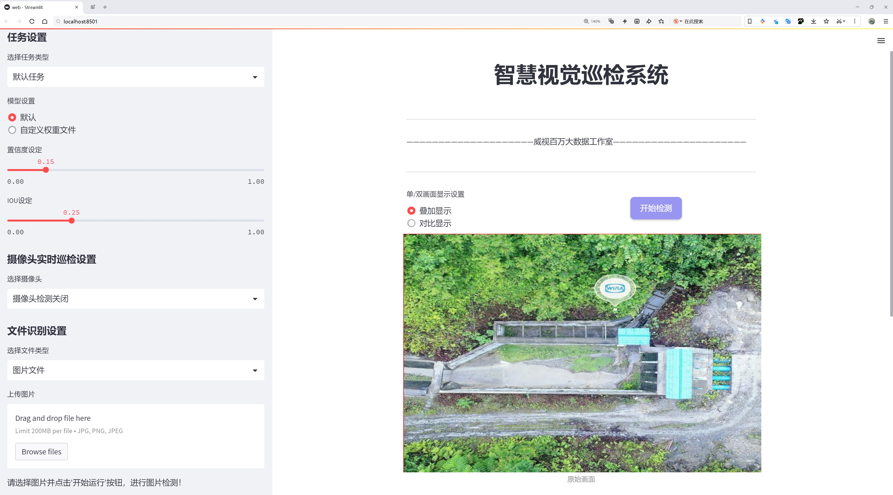
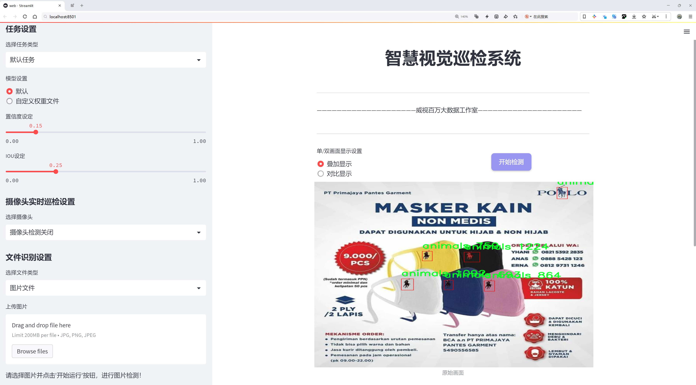
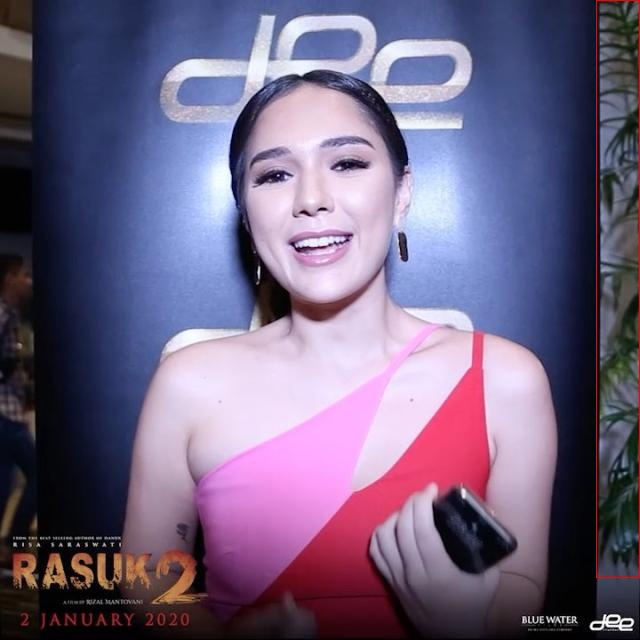

# 自然场景动植物目标检测检测系统源码分享
 # [一条龙教学YOLOV8标注好的数据集一键训练_70+全套改进创新点发刊_Web前端展示]

### 1.研究背景与意义

项目参考[AAAI Association for the Advancement of Artificial Intelligence](https://gitee.com/qunmasj/projects)

研究背景与意义

随着人工智能技术的迅猛发展，计算机视觉在各个领域的应用愈加广泛，尤其是在目标检测方面。目标检测不仅在自动驾驶、安防监控等领域展现出重要价值，还在生态保护、农业监测等自然场景的应用中逐渐受到重视。尤其是在动植物监测领域，准确、高效的目标检测系统能够为生物多样性保护、生态环境监测提供重要支持。近年来，YOLO（You Only Look Once）系列模型因其快速的检测速度和较高的准确率，成为目标检测领域的热门选择。YOLOv8作为该系列的最新版本，进一步提升了检测精度和实时性，为复杂自然场景中的动植物目标检测提供了新的可能性。

本研究旨在基于改进的YOLOv8模型，构建一个高效的自然场景动植物目标检测系统。为实现这一目标，我们将利用包含2998张图像的earth_imagery数据集，该数据集涵盖了五个类别：动物、花卉、自然景观、植物和树木。这些类别的多样性使得我们的研究不仅限于单一目标的检测，而是能够在复杂的自然环境中实现多目标的识别与定位。通过对该数据集的深入分析与处理，我们期望能够提升模型在不同类别目标检测中的表现，尤其是在背景复杂、目标形态多样的自然场景中。

动植物目标检测系统的构建具有重要的理论和实践意义。从理论层面来看，研究自然场景中的目标检测能够推动计算机视觉技术在复杂环境下的应用发展，丰富目标检测算法的研究内容。同时，通过对YOLOv8模型的改进，我们可以探索更为高效的特征提取与融合方法，进一步提升目标检测的准确性和速度。这将为后续的研究提供新的思路和方法。

从实践层面来看，动植物目标检测系统的实现将为生态保护、农业监测等领域提供强有力的技术支持。在生态保护方面，该系统能够帮助研究人员快速识别和监测特定物种的分布情况，进而为生物多样性保护提供数据支持。在农业监测方面，系统能够实时监测作物生长情况，及时发现病虫害，从而提高农业生产效率和可持续发展能力。此外，该系统还可以应用于自然景观的保护与恢复，帮助相关部门及时发现和处理环境问题。

综上所述，基于改进YOLOv8的自然场景动植物目标检测系统的研究，不仅在理论上推动了目标检测技术的发展，也在实践中为生态保护和农业监测提供了重要的技术支持。通过对earth_imagery数据集的深入挖掘与应用，我们期待能够实现高效、准确的动植物目标检测，为保护自然环境和促进可持续发展贡献一份力量。

### 2.图片演示







##### 注意：由于此博客编辑较早，上面“2.图片演示”和“3.视频演示”展示的系统图片或者视频可能为老版本，新版本在老版本的基础上升级如下：（实际效果以升级的新版本为准）

  （1）适配了YOLOV8的“目标检测”模型和“实例分割”模型，通过加载相应的权重（.pt）文件即可自适应加载模型。

  （2）支持“图片识别”、“视频识别”、“摄像头实时识别”三种识别模式。

  （3）支持“图片识别”、“视频识别”、“摄像头实时识别”三种识别结果保存导出，解决手动导出（容易卡顿出现爆内存）存在的问题，识别完自动保存结果并导出到。

  （4）支持Web前端系统中的标题、背景图等自定义修改，后面提供修改教程。

  另外本项目提供训练的数据集和训练教程,暂不提供权重文件（best.pt）,需要您按照教程进行训练后实现图片演示和Web前端界面演示的效果。

### 3.视频演示

[3.1 视频演示](https://www.bilibili.com/video/BV16aWreiEEV/?vd_source=ff015de2d29cbe2a9cdbfa7064407a08)

### 4.数据集信息展示

数据集信息展示

本数据集名为“earth_imagery”，专为改进YOLOv8的自然场景动植物目标检测系统而设计，旨在为研究人员和开发者提供一个高质量的训练基础。该数据集包含2998幅图像，涵盖了五个主要类别，分别是动物、花卉、自然景观、植物和树木。这些类别的选择不仅反映了自然界的多样性，也为目标检测模型的训练提供了丰富的样本，帮助模型在复杂的自然环境中更好地识别和分类对象。

在数据集的构建过程中，图像的采集和标注经过严格的筛选和验证，确保每一幅图像都能真实地代表其所对应的类别。这种高质量的标注对于目标检测模型的训练至关重要，因为它直接影响到模型的学习效果和最终的检测精度。通过多样化的图像来源，数据集涵盖了不同的拍摄角度、光照条件和背景环境，使得模型在面对真实世界中的各种变化时，能够保持较高的鲁棒性。

数据集中包含的五个类别各具特色。动物类图像展示了多种动物在自然环境中的生动场景，涵盖了从小型鸟类到大型哺乳动物的多样性；花卉类则提供了丰富的植物花朵图像，展示了不同种类的花卉在不同季节和光照条件下的表现；自然景观类图像则描绘了壮丽的山川、湖泊和森林，提供了广阔的背景供模型学习；植物类图像包括各种草本和木本植物，展示了它们在自然生态系统中的重要性；树木类则专注于不同种类的树木，强调了它们在环境保护和生态平衡中的关键角色。

该数据集的使用许可为CC BY 4.0，允许用户在遵循相应的署名要求下自由使用和分享数据。这一开放的许可政策不仅促进了学术界和工业界的合作，也鼓励更多的研究者参与到自然场景目标检测的研究中来。通过共享数据集，研究人员可以在相同的基础上进行比较和改进，从而推动整个领域的发展。

总之，“earth_imagery”数据集为改进YOLOv8的自然场景动植物目标检测系统提供了坚实的基础。其丰富的图像数量和多样的类别设置，确保了模型在训练过程中能够接触到各种自然场景的特征。这将有助于提升模型的识别能力和适应性，使其在实际应用中能够更准确地检测和分类动植物目标。随着技术的不断进步和数据集的不断更新，未来的目标检测系统将能够在更复杂的环境中表现出色，为生态保护和生物多样性研究提供有力支持。





### 5.全套项目环境部署视频教程（零基础手把手教学）

[5.1 环境部署教程链接（零基础手把手教学）](https://www.ixigua.com/7404473917358506534?logTag=c807d0cbc21c0ef59de5)


[5.2 安装Python虚拟环境创建和依赖库安装视频教程链接（零基础手把手教学）](https://www.ixigua.com/7404474678003106304?logTag=1f1041108cd1f708b01a)

### 6.手把手YOLOV8训练视频教程（零基础小白有手就能学会）

[6.1 环境部署教程链接（零基础手把手教学）](https://www.ixigua.com/7404477157818401292?logTag=d31a2dfd1983c9668658)

### 7.70+种全套YOLOV8创新点代码加载调参视频教程（一键加载写好的改进模型的配置文件）

[7.1 环境部署教程链接（零基础手把手教学）](https://www.ixigua.com/7404478314661806627?logTag=29066f8288e3f4eea3a4)

### 8.70+种全套YOLOV8创新点原理讲解（非科班也可以轻松写刊发刊，V10版本正在科研待更新）

由于篇幅限制，每个创新点的具体原理讲解就不一一展开，具体见下列网址中的创新点对应子项目的技术原理博客网址【Blog】：


[8.1 70+种全套YOLOV8创新点原理讲解链接](https://gitee.com/qunmasj/good)

### 9.系统功能展示（检测对象为举例，实际内容以本项目数据集为准）

图1.系统支持检测结果表格显示

  图2.系统支持置信度和IOU阈值手动调节

  图3.系统支持自定义加载权重文件best.pt(需要你通过步骤5中训练获得)

  图4.系统支持摄像头实时识别

  图5.系统支持图片识别

  图6.系统支持视频识别

  图7.系统支持识别结果文件自动保存

  图8.系统支持Excel导出检测结果数据


### 10.原始YOLOV8算法原理

原始YOLOv8算法原理

YOLOv8算法是YOLO系列目标检测算法的最新版本，建立在YOLOv5和YOLOv7的基础上，旨在进一步提升目标检测的精度和速度。其架构依旧遵循YOLO系列的设计理念，包含输入层、主干网络、特征融合层和解耦头，构成了一个高效的目标检测系统。尽管YOLOv8的论文尚未正式发表，但其创新性和改进措施已经引起了广泛关注。

在YOLOv8的主干网络中，采用了CSPDarknet的思想，这一结构的核心在于通过引入C2f模块替代YOLOv5中的C3模块，实现了模型的轻量化，同时保持了检测精度。C2f模块的设计灵感来源于YOLOv7的ELAN结构，它通过将输入特征图分为两个分支，并通过多个Bottleneck层进行串并联处理，增强了特征提取的能力。具体而言，C2f模块由多个CBS（卷积+归一化+SiLU激活）模块和Bottleneck层构成，能够有效地缓解深层网络中的梯度消失问题，促进浅层特征的重用。通过这种设计，YOLOv8能够提取出更丰富的特征信息，提升模型的表现。

在特征融合层，YOLOv8采用了PAN-FPN（路径聚合网络-特征金字塔网络）结构。这一结构的优势在于能够充分融合不同层次的特征信息，确保模型在处理多尺度目标时的准确性。YOLOv8对YOLOv5的上采样阶段进行了优化，去除了1x1卷积层，直接将高层特征上采样后与中层特征进行拼接，从而实现更高效的特征融合。通过这种方式，YOLOv8能够更好地结合浅层特征的细节信息与高层特征的语义信息，从而提高目标检测的准确性。

YOLOv8在目标检测的实现上，采用了Anchor-Free的策略，抛弃了传统的Anchor-Base方法。这一创新使得YOLOv8能够直接预测目标的中心点和宽高比例，减少了Anchor框的数量，进而提高了检测速度和准确度。这种方法不仅简化了模型的设计，还使得YOLOv8在处理复杂场景时表现得更加灵活。

在损失函数的设计上，YOLOv8引入了VFLLoss作为分类损失，并结合DFLLoss和CIoULoss来优化回归损失。这种组合损失函数的设计旨在提高模型在面对样本不平衡和困难样本时的鲁棒性。尤其是在处理小目标时，Focal Loss的引入能够有效地聚焦于难以分类的样本，从而提升模型的学习效果。

YOLOv8的样本匹配策略也经历了重要的变革，由静态匹配转变为Task-Aligned的Assigner匹配方式。这一变化使得模型在训练过程中能够更好地适应不同的任务需求，提高了样本匹配的灵活性和准确性。

在数据预处理方面，YOLOv8采用了YOLOv5的策略，包括马赛克增强、混合增强、空间扰动和颜色扰动等多种数据增强手段。这些增强手段的引入，不仅丰富了训练数据的多样性，还有效提升了模型的泛化能力。

YOLOv8的Head部分采用了解耦头的结构，借鉴了YOLOX和YOLOv6的设计理念。通过将分类和回归分支进行解耦，YOLOv8能够加速模型的收敛，并提高检测精度。Head部分的输出特征图尺度为80x80、40x40和20x20，确保了模型在不同尺度下的检测能力。

总的来说，YOLOv8在多个方面进行了创新和改进，结合了先进的网络结构和高效的训练策略，使得其在目标检测任务中展现出卓越的性能。通过引入C2f模块、PAN-FPN结构、Anchor-Free检测方式以及优化的损失函数，YOLOv8不仅提高了检测精度，还显著提升了检测速度。这些特性使得YOLOv8成为当前目标检测领域中的一项重要进展，具有广泛的应用前景。随着YOLOv8的进一步研究和发展，预计将会在智能监控、自动驾驶、无人机等多个领域发挥重要作用。


### 11.项目核心源码讲解（再也不用担心看不懂代码逻辑）

#### 11.1 ultralytics\engine\results.py

以下是经过精简和注释的核心代码部分，保留了主要功能和结构，同时对每个类和方法进行了详细的中文注释。

```python
import numpy as np
import torch
from ultralytics.utils import ops

class BaseTensor:
    """基础张量类，提供对数据的基本操作和设备管理。"""

    def __init__(self, data, orig_shape):
        """
        初始化BaseTensor。

        参数:
            data (torch.Tensor | np.ndarray): 预测结果，如边界框、掩码和关键点。
            orig_shape (tuple): 原始图像的形状。
        """
        assert isinstance(data, (torch.Tensor, np.ndarray))
        self.data = data
        self.orig_shape = orig_shape

    def cpu(self):
        """返回一个在CPU内存上的张量副本。"""
        return self.__class__(self.data.cpu(), self.orig_shape) if isinstance(self.data, torch.Tensor) else self

    def numpy(self):
        """返回一个作为numpy数组的张量副本。"""
        return self.__class__(self.data.numpy(), self.orig_shape) if isinstance(self.data, torch.Tensor) else self

    def cuda(self):
        """返回一个在GPU内存上的张量副本。"""
        return self.__class__(self.data.cuda(), self.orig_shape)

class Results:
    """存储和操作推理结果的类。"""

    def __init__(self, orig_img, path, names, boxes=None, masks=None, probs=None, keypoints=None):
        """
        初始化Results类。

        参数:
            orig_img (numpy.ndarray): 原始图像。
            path (str): 图像文件路径。
            names (dict): 类别名称字典。
            boxes (torch.tensor, optional): 检测到的边界框。
            masks (torch.tensor, optional): 检测到的掩码。
            probs (torch.tensor, optional): 每个类别的概率。
            keypoints (List[List[float]], optional): 检测到的关键点。
        """
        self.orig_img = orig_img
        self.orig_shape = orig_img.shape[:2]
        self.boxes = Boxes(boxes, self.orig_shape) if boxes is not None else None
        self.masks = Masks(masks, self.orig_shape) if masks is not None else None
        self.probs = Probs(probs) if probs is not None else None
        self.keypoints = Keypoints(keypoints, self.orig_shape) if keypoints is not None else None
        self.names = names
        self.path = path

    def plot(self):
        """在原始图像上绘制检测结果并返回带注释的图像。"""
        # 这里省略了具体的绘制逻辑
        pass

class Boxes(BaseTensor):
    """存储和操作检测框的类。"""

    def __init__(self, boxes, orig_shape):
        """初始化Boxes类。"""
        super().__init__(boxes, orig_shape)

    @property
    def xyxy(self):
        """返回xyxy格式的边界框。"""
        return self.data[:, :4]

class Masks(BaseTensor):
    """存储和操作检测掩码的类。"""

    def __init__(self, masks, orig_shape):
        """初始化Masks类。"""
        super().__init__(masks, orig_shape)

class Keypoints(BaseTensor):
    """存储和操作检测关键点的类。"""

    def __init__(self, keypoints, orig_shape):
        """初始化Keypoints类。"""
        super().__init__(keypoints, orig_shape)

class Probs(BaseTensor):
    """存储和操作分类预测的类。"""

    def __init__(self, probs, orig_shape=None):
        """初始化Probs类。"""
        super().__init__(probs, orig_shape)

# 省略了OBB类和其他细节，专注于核心功能
```

### 代码说明
1. **BaseTensor类**: 这是一个基础类，提供了对张量的基本操作，包括在CPU和GPU之间的转换，以及将张量转换为numpy数组的功能。

2. **Results类**: 这个类用于存储推理结果，包括原始图像、路径、类别名称、边界框、掩码、概率和关键点。它还包含绘制检测结果的方法。

3. **Boxes、Masks、Keypoints、Probs类**: 这些类继承自BaseTensor，分别用于处理检测框、掩码、关键点和分类概率。每个类都实现了特定的功能，如返回特定格式的数据。

以上代码保留了核心结构和功能，并进行了详细的中文注释，以便于理解和使用。

该文件是Ultralytics YOLO（You Only Look Once）模型的一个结果处理模块，主要用于处理推理结果，包括边界框、掩码和关键点等。文件中定义了多个类，分别用于存储和操作这些结果。

首先，`BaseTensor`类是一个基础类，提供了一些便捷的方法来处理张量数据，包括在不同设备（CPU和GPU）之间的转换，以及将张量转换为NumPy数组。它的构造函数接受数据和原始图像的形状，并提供了多种属性和方法来获取张量的形状、长度以及特定索引的数据。

接下来是`Results`类，它用于存储和操作推理结果。该类的构造函数接受原始图像、文件路径、类别名称以及可选的边界框、掩码、概率和关键点数据。它包含多个属性，如原始图像、原始形状、边界框、掩码、概率、关键点等。该类还提供了更新、获取长度、索引访问等方法，以及将结果绘制到图像上的`plot`方法。

`Boxes`、`Masks`、`Keypoints`、`Probs`和`OBB`类分别用于处理边界框、掩码、关键点、分类概率和定向边界框（OBB）。这些类继承自`BaseTensor`，并提供了特定于各自数据类型的属性和方法。例如，`Boxes`类提供了获取边界框坐标、置信度、类别等信息的方法；`Masks`类用于处理检测到的掩码；`Keypoints`类用于处理关键点的坐标和置信度；`Probs`类用于处理分类任务的概率。

此外，`Results`类还提供了将结果保存为文本文件、裁剪保存检测结果、转换为JSON格式等功能。这些功能使得用户可以方便地对推理结果进行后续处理和分析。

总体而言，该文件为YOLO模型的推理结果提供了全面的处理能力，使得用户能够轻松地获取和可视化检测结果。

#### 11.2 ultralytics\trackers\utils\kalman_filter.py

以下是简化后的代码，保留了核心部分，并进行了详细的中文注释：

```python
import numpy as np
import scipy.linalg

class KalmanFilter:
    """
    简单的卡尔曼滤波器，用于跟踪图像空间中的边界框。
    状态空间包含边界框中心位置 (x, y)、宽度 w、高度 h 及其对应的速度。
    运动模型遵循恒定速度模型。
    """

    def __init__(self):
        """初始化卡尔曼滤波器模型矩阵和不确定性权重。"""
        ndim, dt = 4, 1.0  # 状态维度和时间间隔

        # 创建卡尔曼滤波器模型矩阵
        self._motion_mat = np.eye(2 * ndim, 2 * ndim)  # 运动矩阵
        for i in range(ndim):
            self._motion_mat[i, ndim + i] = dt  # 设置速度部分
        self._update_mat = np.eye(ndim, 2 * ndim)  # 更新矩阵

        # 运动和观测不确定性权重
        self._std_weight_position = 1.0 / 20
        self._std_weight_velocity = 1.0 / 160

    def initiate(self, measurement: np.ndarray) -> tuple:
        """
        从未关联的测量创建跟踪。

        Args:
            measurement (ndarray): 边界框坐标 (x, y, w, h)。

        Returns:
            (tuple[ndarray, ndarray]): 返回新的跟踪的均值向量和协方差矩阵。
        """
        mean_pos = measurement  # 位置均值
        mean_vel = np.zeros_like(mean_pos)  # 速度均值初始化为0
        mean = np.r_[mean_pos, mean_vel]  # 合并位置和速度均值

        # 计算协方差矩阵的标准差
        std = [
            2 * self._std_weight_position * measurement[2],  # 宽度的标准差
            2 * self._std_weight_position * measurement[3],  # 高度的标准差
            10 * self._std_weight_velocity * measurement[2],  # 速度的标准差
            10 * self._std_weight_velocity * measurement[3],
        ]
        covariance = np.diag(np.square(std))  # 协方差矩阵
        return mean, covariance

    def predict(self, mean: np.ndarray, covariance: np.ndarray) -> tuple:
        """
        执行卡尔曼滤波器预测步骤。

        Args:
            mean (ndarray): 上一时间步的状态均值向量。
            covariance (ndarray): 上一时间步的状态协方差矩阵。

        Returns:
            (tuple[ndarray, ndarray]): 返回预测状态的均值向量和协方差矩阵。
        """
        # 计算运动协方差
        std_pos = [
            self._std_weight_position * mean[2],  # 宽度的标准差
            self._std_weight_position * mean[3],  # 高度的标准差
        ]
        std_vel = [
            self._std_weight_velocity * mean[2],  # 速度的标准差
            self._std_weight_velocity * mean[3],
        ]
        motion_cov = np.diag(np.square(np.r_[std_pos, std_vel]))  # 运动协方差矩阵

        mean = np.dot(mean, self._motion_mat.T)  # 更新均值
        covariance = np.linalg.multi_dot((self._motion_mat, covariance, self._motion_mat.T)) + motion_cov  # 更新协方差

        return mean, covariance

    def update(self, mean: np.ndarray, covariance: np.ndarray, measurement: np.ndarray) -> tuple:
        """
        执行卡尔曼滤波器校正步骤。

        Args:
            mean (ndarray): 预测状态的均值向量。
            covariance (ndarray): 状态的协方差矩阵。
            measurement (ndarray): 测量向量 (x, y, w, h)。

        Returns:
            (tuple[ndarray, ndarray]): 返回测量校正后的状态分布。
        """
        # 先将状态投影到测量空间
        projected_mean, projected_cov = self.project(mean, covariance)

        # 计算卡尔曼增益
        chol_factor, lower = scipy.linalg.cho_factor(projected_cov, lower=True)
        kalman_gain = scipy.linalg.cho_solve(
            (chol_factor, lower), np.dot(covariance, self._update_mat.T).T
        ).T
        innovation = measurement - projected_mean  # 计算创新

        # 更新均值和协方差
        new_mean = mean + np.dot(innovation, kalman_gain.T)
        new_covariance = covariance - np.linalg.multi_dot((kalman_gain, projected_cov, kalman_gain.T))
        return new_mean, new_covariance

    def project(self, mean: np.ndarray, covariance: np.ndarray) -> tuple:
        """
        将状态分布投影到测量空间。

        Args:
            mean (ndarray): 状态的均值向量。
            covariance (ndarray): 状态的协方差矩阵。

        Returns:
            (tuple[ndarray, ndarray]): 返回投影后的均值和协方差矩阵。
        """
        std = [
            self._std_weight_position * mean[2],  # 宽度的标准差
            self._std_weight_position * mean[3],  # 高度的标准差
        ]
        innovation_cov = np.diag(np.square(std))  # 创新协方差

        mean = np.dot(self._update_mat, mean)  # 更新均值
        covariance = np.linalg.multi_dot((self._update_mat, covariance, self._update_mat.T)) + innovation_cov  # 更新协方差
        return mean, covariance
```

### 代码说明：
1. **KalmanFilter 类**：这是一个简单的卡尔曼滤波器类，用于跟踪图像中的边界框。
2. **初始化方法**：设置状态维度、时间间隔、运动矩阵和更新矩阵，并定义运动和观测的不确定性权重。
3. **initiate 方法**：根据测量值初始化跟踪的均值和协方差矩阵。
4. **predict 方法**：执行预测步骤，更新状态的均值和协方差。
5. **update 方法**：执行校正步骤，根据测量值更新状态的均值和协方差。
6. **project 方法**：将状态分布投影到测量空间，计算投影后的均值和协方差。

这个程序文件实现了一个简单的卡尔曼滤波器，用于在图像空间中跟踪边界框。它包含两个类：`KalmanFilterXYAH`和`KalmanFilterXYWH`，分别用于处理不同的边界框表示方式。

`KalmanFilterXYAH`类使用8维状态空间，包括边界框的中心位置（x, y）、宽高比（a）、高度（h）及其各自的速度（vx, vy, va, vh）。该类的主要功能是初始化卡尔曼滤波器的模型矩阵，进行预测、更新和距离计算等操作。初始化时，类构造函数设置了运动矩阵和更新矩阵，并定义了运动和观测的不确定性权重。

在`initiate`方法中，输入的测量值（边界框的坐标）被用来创建新的跟踪对象的均值向量和协方差矩阵。`predict`方法用于执行卡尔曼滤波的预测步骤，更新状态的均值和协方差。`project`方法将状态分布投影到测量空间，便于与实际测量值进行比较。`update`方法则执行卡尔曼滤波的校正步骤，通过结合预测值和实际测量值来更新状态。

`KalmanFilterXYWH`类继承自`KalmanFilterXYAH`，其主要区别在于状态空间的定义。它使用边界框的中心位置（x, y）、宽度（w）、高度（h）及其速度（vx, vy, vw, vh）作为状态空间。该类重写了`initiate`、`predict`和`project`方法，以适应新的状态表示方式。

此外，`gating_distance`方法用于计算状态分布与测量值之间的距离，支持两种度量方式：高斯距离和马哈距离。这个功能可以帮助判断测量值是否与当前状态分布相符。

总体而言，这个文件实现了卡尔曼滤波器的基本功能，适用于跟踪任务中的边界框，并提供了灵活的接口以适应不同的状态表示。

#### 11.3 ui.py

以下是保留的核心代码部分，并附上详细的中文注释：

```python
import sys
import subprocess

def run_script(script_path):
    """
    使用当前 Python 环境运行指定的脚本。

    Args:
        script_path (str): 要运行的脚本路径

    Returns:
        None
    """
    # 获取当前 Python 解释器的路径
    python_path = sys.executable

    # 构建运行命令，使用 streamlit 运行指定的脚本
    command = f'"{python_path}" -m streamlit run "{script_path}"'

    # 执行命令
    result = subprocess.run(command, shell=True)
    # 检查命令执行结果，如果返回码不为0，表示执行出错
    if result.returncode != 0:
        print("脚本运行出错。")

# 主程序入口
if __name__ == "__main__":
    # 指定要运行的脚本路径
    script_path = "web.py"  # 这里可以直接指定脚本路径

    # 调用函数运行脚本
    run_script(script_path)
```

### 注释说明：
1. **导入模块**：
   - `sys`：用于访问与 Python 解释器相关的变量和函数。
   - `subprocess`：用于执行外部命令和与其交互。

2. **`run_script` 函数**：
   - 该函数接受一个参数 `script_path`，表示要运行的 Python 脚本的路径。
   - 使用 `sys.executable` 获取当前 Python 解释器的路径，以确保使用相同的环境运行脚本。
   - 构建一个命令字符串，使用 `streamlit` 模块运行指定的脚本。
   - 使用 `subprocess.run` 执行构建的命令，并通过 `shell=True` 允许在 shell 中执行命令。
   - 检查命令的返回码，如果不为0，表示脚本运行出错，打印错误信息。

3. **主程序入口**：
   - 通过 `if __name__ == "__main__":` 确保只有在直接运行该脚本时才会执行以下代码。
   - 指定要运行的脚本路径（这里是 `web.py`）。
   - 调用 `run_script` 函数来执行指定的脚本。

这个程序文件名为 `ui.py`，主要功能是通过当前的 Python 环境运行一个指定的脚本，具体是一个名为 `web.py` 的文件。程序的实现过程如下：

首先，程序导入了几个必要的模块，包括 `sys`、`os` 和 `subprocess`。其中，`sys` 模块用于访问与 Python 解释器相关的变量和函数，`os` 模块提供了与操作系统交互的功能，而 `subprocess` 模块则用于创建新进程、连接到它们的输入/输出/错误管道，并获取它们的返回码。

接着，程序从 `QtFusion.path` 模块中导入了 `abs_path` 函数，这个函数的作用是获取文件的绝对路径。

在 `run_script` 函数中，程序接收一个参数 `script_path`，这个参数是要运行的脚本的路径。函数首先获取当前 Python 解释器的路径，并将其存储在 `python_path` 变量中。然后，程序构建一个命令字符串，该命令用于运行 `streamlit` 模块，并指定要执行的脚本路径。这里使用了 `-m` 参数来运行模块。

随后，程序使用 `subprocess.run` 方法执行构建好的命令。这个方法会在一个新的 shell 中运行命令，并等待命令执行完成。执行完成后，程序检查返回码，如果返回码不为 0，表示脚本运行出错，程序会输出一条错误信息。

最后，在程序的主入口部分（`if __name__ == "__main__":`），程序指定了要运行的脚本路径，这里使用了 `abs_path` 函数来获取 `web.py` 的绝对路径。然后调用 `run_script` 函数来执行这个脚本。

总体来看，这个程序的主要目的是为用户提供一个简单的接口，以便通过当前的 Python 环境运行指定的脚本，尤其是用于启动一个基于 Streamlit 的 Web 应用。

#### 11.4 train.py

以下是经过简化和注释的核心代码部分：

```python
import os
import torch
import yaml
from ultralytics import YOLO  # 导入YOLO模型库
from QtFusion.path import abs_path  # 导入路径处理工具

# 设置设备为GPU（如果可用），否则使用CPU
device = "0" if torch.cuda.is_available() else "cpu"

if __name__ == '__main__':  # 确保该模块被直接运行时才执行以下代码
    # 设置数据加载的工作进程数和批次大小
    workers = 1
    batch = 2

    # 数据集名称
    data_name = "data"
    # 获取数据集yaml文件的绝对路径
    data_path = abs_path(f'datasets/{data_name}/{data_name}.yaml', path_type='current')
    unix_style_path = data_path.replace(os.sep, '/')  # 将路径转换为Unix风格

    # 获取数据集目录路径
    directory_path = os.path.dirname(unix_style_path)
    
    # 读取YAML配置文件
    with open(data_path, 'r') as file:
        data = yaml.load(file, Loader=yaml.FullLoader)
    
    # 如果YAML文件中有'path'项，则更新为当前目录路径
    if 'path' in data:
        data['path'] = directory_path
        # 将修改后的数据写回YAML文件
        with open(data_path, 'w') as file:
            yaml.safe_dump(data, file, sort_keys=False)

    # 加载YOLOv8模型配置
    model = YOLO(model='./ultralytics/cfg/models/v8/yolov8s.yaml', task='detect')
    
    # 开始训练模型
    results2 = model.train(
        data=data_path,  # 指定训练数据的配置文件路径
        device=device,  # 指定训练设备
        workers=workers,  # 指定数据加载的工作进程数
        imgsz=640,  # 输入图像的大小
        epochs=100,  # 训练的轮数
        batch=batch,  # 每个批次的大小
        name='train_v8_' + data_name  # 训练任务的名称
    )
```

### 代码注释说明：
1. **导入库**：导入必要的库，包括操作系统、PyTorch、YAML解析库和YOLO模型库。
2. **设备选择**：根据是否有可用的GPU选择训练设备。
3. **主程序入口**：使用`if __name__ == '__main__':`确保代码仅在直接运行时执行。
4. **设置参数**：定义数据加载的工作进程数和批次大小。
5. **数据集路径**：构建数据集的YAML配置文件的绝对路径，并转换为Unix风格路径。
6. **读取和修改YAML文件**：读取YAML文件，更新其中的`path`项为当前目录路径，并将修改后的内容写回文件。
7. **加载YOLO模型**：加载YOLOv8模型的配置文件。
8. **训练模型**：调用模型的`train`方法，开始训练，传入数据路径、设备、工作进程数、图像大小、训练轮数和批次大小等参数。

该程序文件 `train.py` 是一个用于训练 YOLOv8 模型的脚本。首先，程序导入了必要的库，包括 `os`、`torch`、`yaml` 和 `ultralytics` 中的 YOLO 模型。接着，程序会检查是否有可用的 GPU，如果有，则将设备设置为 "0"（表示使用第一个 GPU），否则使用 CPU。

在 `__main__` 代码块中，程序首先定义了一些训练参数，包括工作进程数 `workers` 和批次大小 `batch`。然后，指定了数据集的名称为 "data"，并构建了数据集 YAML 文件的绝对路径。接下来，程序将路径中的分隔符转换为 UNIX 风格的斜杠。

程序获取数据集 YAML 文件所在的目录路径，并打开该文件以读取其内容。使用 `yaml` 库加载 YAML 文件后，程序检查其中是否包含 `path` 项。如果存在，程序将其值修改为数据集的目录路径，并将修改后的内容写回 YAML 文件中，以确保路径的正确性。

接下来，程序加载了预训练的 YOLOv8 模型，指定了模型的配置文件路径和任务类型为检测。然后，调用模型的 `train` 方法开始训练，传入的数据配置文件路径、设备、工作进程数、输入图像大小（640x640）、训练的 epoch 数（100）以及批次大小（2）。最后，训练任务的名称被设置为 `train_v8_` 加上数据集名称。

总体来说，该脚本的主要功能是配置并启动 YOLOv8 模型的训练过程，确保数据集路径的正确性，并设置相关的训练参数。

#### 11.5 ultralytics\utils\loss.py

以下是经过简化和注释的核心代码部分，主要集中在损失计算的类上：

```python
import torch
import torch.nn as nn
import torch.nn.functional as F

class VarifocalLoss(nn.Module):
    """
    Varifocal Loss 计算类，基于 Zhang 等人的论文。
    """

    def __init__(self):
        """初始化 VarifocalLoss 类。"""
        super().__init__()

    @staticmethod
    def forward(pred_score, gt_score, label, alpha=0.75, gamma=2.0):
        """
        计算 Varifocal Loss。
        
        参数:
        - pred_score: 预测的分数
        - gt_score: 真实的分数
        - label: 标签
        - alpha: 权重参数
        - gamma: 调制参数
        
        返回:
        - loss: 计算得到的损失值
        """
        # 计算权重
        weight = alpha * pred_score.sigmoid().pow(gamma) * (1 - label) + gt_score * label
        # 计算损失
        loss = (
            (F.binary_cross_entropy_with_logits(pred_score.float(), gt_score.float(), reduction="none") * weight)
            .mean(1)
            .sum()
        )
        return loss


class BboxLoss(nn.Module):
    """计算边界框损失的类。"""

    def __init__(self, reg_max, use_dfl=False):
        """初始化 BboxLoss 模块。"""
        super().__init__()
        self.reg_max = reg_max  # 最大回归值
        self.use_dfl = use_dfl  # 是否使用分布焦点损失

    def forward(self, pred_dist, pred_bboxes, anchor_points, target_bboxes, target_scores, target_scores_sum, fg_mask):
        """
        计算 IoU 损失和 DFL 损失。
        
        参数:
        - pred_dist: 预测的分布
        - pred_bboxes: 预测的边界框
        - anchor_points: 锚点
        - target_bboxes: 目标边界框
        - target_scores: 目标分数
        - target_scores_sum: 目标分数总和
        - fg_mask: 前景掩码
        
        返回:
        - loss_iou: IoU 损失
        - loss_dfl: DFL 损失
        """
        weight = target_scores.sum(-1)[fg_mask].unsqueeze(-1)  # 权重
        iou = bbox_iou(pred_bboxes[fg_mask], target_bboxes[fg_mask], xywh=False, CIoU=True)  # 计算 IoU
        loss_iou = ((1.0 - iou) * weight).sum() / target_scores_sum  # IoU 损失

        # DFL 损失
        if self.use_dfl:
            target_ltrb = bbox2dist(anchor_points, target_bboxes, self.reg_max)  # 转换目标边界框
            loss_dfl = self._df_loss(pred_dist[fg_mask].view(-1, self.reg_max + 1), target_ltrb[fg_mask]) * weight
            loss_dfl = loss_dfl.sum() / target_scores_sum
        else:
            loss_dfl = torch.tensor(0.0).to(pred_dist.device)

        return loss_iou, loss_dfl

    @staticmethod
    def _df_loss(pred_dist, target):
        """计算分布焦点损失。"""
        tl = target.long()  # 左边界
        tr = tl + 1  # 右边界
        wl = tr - target  # 左权重
        wr = 1 - wl  # 右权重
        return (
            F.cross_entropy(pred_dist, tl.view(-1), reduction="none").view(tl.shape) * wl
            + F.cross_entropy(pred_dist, tr.view(-1), reduction="none").view(tl.shape) * wr
        ).mean(-1, keepdim=True)


class v8DetectionLoss:
    """计算 YOLO 模型训练损失的类。"""

    def __init__(self, model):
        """初始化 v8DetectionLoss，设置模型相关属性和损失函数。"""
        device = next(model.parameters()).device  # 获取模型设备
        h = model.args  # 超参数

        m = model.model[-1]  # Detect() 模块
        self.bce = nn.BCEWithLogitsLoss(reduction="none")  # 二元交叉熵损失
        self.hyp = h  # 超参数
        self.stride = m.stride  # 模型步幅
        self.nc = m.nc  # 类别数量
        self.reg_max = m.reg_max  # 最大回归值
        self.device = device

        self.use_dfl = m.reg_max > 1  # 是否使用 DFL

        self.bbox_loss = BboxLoss(m.reg_max - 1, use_dfl=self.use_dfl).to(device)  # 初始化边界框损失

    def __call__(self, preds, batch):
        """计算边界框、分类和 DFL 的损失。"""
        loss = torch.zeros(3, device=self.device)  # box, cls, dfl
        feats = preds[1] if isinstance(preds, tuple) else preds  # 获取特征
        pred_distri, pred_scores = torch.cat([xi.view(feats[0].shape[0], self.nc, -1) for xi in feats], 2).split(
            (self.reg_max * 4, self.nc), 1
        )

        # 计算目标
        targets = torch.cat((batch["batch_idx"].view(-1, 1), batch["cls"].view(-1, 1), batch["bboxes"]), 1)
        gt_labels, gt_bboxes = targets.split((1, 4), 2)  # 类别和边界框
        mask_gt = gt_bboxes.sum(2, keepdim=True).gt_(0)  # 生成掩码

        # 计算损失
        _, target_bboxes, target_scores, fg_mask, _ = self.assigner(
            pred_scores.detach().sigmoid(),
            pred_bboxes.detach(),
            gt_labels,
            gt_bboxes,
            mask_gt,
        )

        target_scores_sum = max(target_scores.sum(), 1)  # 目标分数总和

        # 分类损失
        loss[1] = self.bce(pred_scores, target_scores.to(pred_scores.dtype)).sum() / target_scores_sum  # BCE

        # 边界框损失
        if fg_mask.sum():
            loss[0], loss[2] = self.bbox_loss(
                pred_distri, pred_bboxes, target_bboxes, target_scores, target_scores_sum, fg_mask
            )

        return loss.sum() * batch_size, loss.detach()  # 返回总损失和分离的损失
```

### 代码说明
1. **VarifocalLoss**: 计算变焦损失，结合了预测分数和真实分数，使用了权重和调制因子来增强损失的计算。
2. **BboxLoss**: 计算边界框的损失，包括 IoU 损失和可选的分布焦点损失（DFL）。
3. **v8DetectionLoss**: 主要的损失计算类，负责计算边界框损失、分类损失和 DFL，整合了多个损失函数的调用。

通过这些核心部分，模型可以有效地训练和优化目标检测任务。

这个程序文件是Ultralytics YOLO（You Only Look Once）模型的一部分，主要用于计算各种损失函数，以优化目标检测、分割和姿态估计等任务。文件中定义了多个损失类，每个类负责计算特定类型的损失，帮助模型在训练过程中进行优化。

首先，`VarifocalLoss`类实现了一种变焦损失（Varifocal Loss），该损失函数通过对预测分数进行加权来提高模型对不同类别的关注度。其`forward`方法接收预测分数、真实分数、标签及一些超参数（如alpha和gamma），并计算损失值。

接下来，`FocalLoss`类实现了焦点损失（Focal Loss），它通过对难以分类的样本施加更大的权重来缓解类别不平衡问题。其`forward`方法计算二元交叉熵损失，并根据预测概率调整损失值。

`BboxLoss`类用于计算边界框的损失，包括IoU（Intersection over Union）损失和可选的DFL（Distribution Focal Loss）。其`forward`方法根据预测的边界框和目标边界框计算损失，并返回IoU损失和DFL损失。

`RotatedBboxLoss`类是`BboxLoss`的扩展，专门用于处理旋转边界框的损失计算，采用类似的逻辑来计算IoU损失和DFL损失。

`KeypointLoss`类用于计算关键点的损失，特别是在姿态估计任务中。它根据预测的关键点和真实关键点之间的欧几里得距离来计算损失，并考虑关键点的可见性。

`v8DetectionLoss`类是一个综合的损失计算类，负责处理目标检测任务中的所有损失计算。它初始化了一些参数，包括模型的设备、超参数和损失函数，并实现了`__call__`方法来计算总损失。

`v8SegmentationLoss`类继承自`v8DetectionLoss`，增加了对分割任务的支持，计算分割损失和其他相关损失。

`v8PoseLoss`类同样继承自`v8DetectionLoss`，专注于姿态估计任务，计算关键点位置和可见性的损失。

`v8ClassificationLoss`类则用于计算分类损失，使用交叉熵损失函数来评估模型的分类性能。

最后，`v8OBBLoss`类用于计算旋转边界框的损失，包含了对目标检测和旋转边界框的处理逻辑。

整体来看，这个文件的设计旨在为YOLO模型提供灵活的损失计算机制，以适应不同的任务需求，包括目标检测、实例分割、姿态估计等。每个损失类都实现了相应的逻辑，确保在训练过程中能够有效地优化模型性能。

#### 11.6 model.py

以下是代码中最核心的部分，并附上详细的中文注释：

```python
# -*- coding: utf-8 -*-
import cv2  # 导入OpenCV库，用于处理图像和视频
import torch  # 导入PyTorch库，用于深度学习
from QtFusion.models import Detector  # 从QtFusion库中导入Detector抽象基类
from chinese_name_list import Chinese_name  # 从datasets库中导入Chinese_name字典，用于获取类别的中文名称
from ultralytics import YOLO  # 从ultralytics库中导入YOLO类，用于加载YOLO模型
from ultralytics.utils.torch_utils import select_device  # 从ultralytics库中导入select_device函数，用于选择设备
import os  # 导入os库，用于处理文件和目录

# 选择计算设备，如果有可用的GPU则使用CUDA，否则使用CPU
device = "cuda:0" if torch.cuda.is_available() else "cpu"

# 初始化参数字典
ini_params = {
    'device': device,  # 设备类型
    'conf': 0.25,  # 物体置信度阈值
    'iou': 0.5,  # 用于非极大值抑制的IOU阈值
    'classes': None,  # 类别过滤器，None表示不过滤任何类别
    'verbose': False  # 是否输出详细信息
}

class Web_Detector(Detector):  # 定义Web_Detector类，继承自Detector类
    def __init__(self, params=None):  # 定义构造函数
        super().__init__(params)  # 调用父类的构造函数
        self.model = None  # 初始化模型为None
        self.img = None  # 初始化图像为None
        self.names = list(Chinese_name.values())  # 获取所有类别的中文名称
        self.params = params if params else ini_params  # 使用提供的参数或默认参数

    def load_model(self, model_path):  # 定义加载模型的方法
        self.device = select_device(self.params['device'])  # 选择计算设备
        # 根据模型文件名判断任务类型
        task = 'segment' if os.path.basename(model_path)[:3] == 'seg' else 'detect'
        self.model = YOLO(model_path, task=task)  # 加载YOLO模型
        names_dict = self.model.names  # 获取类别名称字典
        # 将类别名称转换为中文
        self.names = [Chinese_name[v] if v in Chinese_name else v for v in names_dict.values()]
        # 预热模型
        self.model(torch.zeros(1, 3, *[self.imgsz] * 2).to(self.device).type_as(next(self.model.model.parameters())))

    def preprocess(self, img):  # 定义预处理方法
        self.img = img  # 保存原始图像
        return img  # 返回处理后的图像

    def predict(self, img):  # 定义预测方法
        results = self.model(img, **ini_params)  # 使用模型进行预测
        return results  # 返回预测结果

    def postprocess(self, pred):  # 定义后处理方法
        results = []  # 初始化结果列表
        for res in pred[0].boxes:  # 遍历预测结果中的每个边界框
            for box in res:  # 遍历每个边界框
                class_id = int(box.cls.cpu())  # 获取类别ID
                bbox = box.xyxy.cpu().squeeze().tolist()  # 获取边界框坐标并转换为列表
                bbox = [int(coord) for coord in bbox]  # 将边界框坐标转换为整数

                # 构建结果字典
                result = {
                    "class_name": self.names[class_id],  # 类别名称
                    "bbox": bbox,  # 边界框
                    "score": box.conf.cpu().squeeze().item(),  # 置信度
                    "class_id": class_id,  # 类别ID
                    "mask": pred[0].masks[aim_id].xy if pred[0].masks is not None else None  # 分割掩码
                }
                results.append(result)  # 将结果添加到列表

        return results  # 返回结果列表

    def set_param(self, params):  # 定义设置参数的方法
        self.params.update(params)  # 更新参数字典
```

### 代码说明：
1. **导入库**：代码导入了处理图像、深度学习和文件操作所需的库。
2. **设备选择**：根据是否有可用的GPU选择计算设备。
3. **参数初始化**：设置了一些默认参数，如置信度阈值和IOU阈值。
4. **Web_Detector类**：该类继承自Detector，主要负责加载模型、处理图像和进行预测。
5. **模型加载**：根据模型路径判断任务类型（检测或分割），并加载YOLO模型。
6. **图像预处理**：保存原始图像以备后续使用。
7. **预测方法**：使用加载的模型对输入图像进行预测。
8. **后处理**：将模型的预测结果转换为易于理解的格式，包括类别名称、边界框、置信度等。
9. **参数设置**：允许更新检测器的参数。

这个程序文件`model.py`主要实现了一个基于YOLO模型的目标检测器，利用OpenCV和PyTorch等库进行图像处理和深度学习模型的加载与推理。首先，程序导入了必要的库，包括OpenCV用于图像和视频处理，PyTorch用于深度学习计算，以及QtFusion和Ultralytics库中的特定类和函数。

在文件的开头，程序通过判断CUDA是否可用来选择计算设备，优先使用GPU（`cuda:0`），否则使用CPU。接着，定义了一些初始化参数，包括物体置信度阈值、IOU阈值、类别过滤器等，这些参数将在后续的模型推理中使用。

接下来，定义了一个名为`count_classes`的函数，用于统计检测结果中每个类别的数量。该函数接收检测信息和类别名称列表作为输入，返回一个包含每个类别计数的列表。它通过遍历检测信息，更新每个类别的计数，并最终返回与类别名称顺序一致的计数列表。

然后，程序定义了一个名为`Web_Detector`的类，继承自`Detector`抽象基类。该类的构造函数初始化了一些属性，包括模型、图像和类别名称等。如果没有提供参数，则使用默认的初始化参数。`load_model`方法用于加载YOLO模型，判断模型类型（检测或分割），并将类别名称转换为中文。此方法还包含一个预热步骤，通过输入一个零张量来初始化模型。

`preprocess`方法用于对输入图像进行预处理，当前实现只是简单地保存原始图像并返回。`predict`方法则调用加载的YOLO模型进行推理，返回预测结果。`postprocess`方法对模型的预测结果进行后处理，提取出每个检测框的类别名称、边界框坐标、置信度和类别ID，并将这些信息存储在一个结果列表中返回。

最后，`set_param`方法允许更新检测器的参数，方便在运行时调整模型的配置。整体来看，这个程序文件提供了一个完整的目标检测框架，能够加载YOLO模型，处理输入图像，并输出检测结果。

### 12.系统整体结构（节选）

### 整体功能和构架概括

该项目是一个基于YOLO（You Only Look Once）模型的目标检测系统，包含多个模块以支持训练、推理、结果处理和后续分析。整体架构分为以下几个主要部分：

1. **模型训练**：`train.py`负责配置和启动YOLO模型的训练过程，处理数据集路径和训练参数。
2. **模型推理**：`model.py`实现了目标检测器，负责加载模型、处理输入图像、进行推理并输出检测结果。
3. **结果处理**：`ultralytics\engine\results.py`处理模型推理的结果，包括边界框、掩码和关键点等信息的存储和可视化。
4. **损失计算**：`ultralytics\utils\loss.py`定义了多种损失函数，用于优化模型在不同任务（如检测、分割、姿态估计等）中的性能。
5. **卡尔曼滤波器**：`ultralytics\trackers\utils\kalman_filter.py`实现了卡尔曼滤波器，用于跟踪目标的边界框。
6. **用户界面**：`ui.py`提供了一个简单的接口，用于通过当前Python环境运行指定的脚本。
7. **匹配算法**：`ultralytics\trackers\utils\matching.py`实现了目标匹配算法，通常用于跟踪任务中，以确保检测到的目标与跟踪器中的目标一致。
8. **其他模块**：`ultralytics\models\yolo\obb\__init__.py`和`ultralytics\models\nas\__init__.py`分别实现了与旋转边界框和神经架构搜索相关的功能。
9. **速度估计**：`ultralytics\solutions\speed_estimation.py`可能涉及对目标运动速度的估计，进一步增强目标检测的应用场景。

### 文件功能整理表

| 文件路径                                          | 功能描述                                                   |
|--------------------------------------------------|------------------------------------------------------------|
| `ultralytics\engine\results.py`                  | 处理推理结果，包括边界框、掩码和关键点的存储与可视化。   |
| `ultralytics\trackers\utils\kalman_filter.py`   | 实现卡尔曼滤波器，用于目标跟踪。                         |
| `ui.py`                                          | 提供用户界面，通过当前Python环境运行指定的脚本。         |
| `train.py`                                       | 配置并启动YOLO模型的训练过程，处理数据集路径和训练参数。 |
| `ultralytics\utils\loss.py`                      | 定义多种损失函数，用于优化模型在不同任务中的性能。       |
| `model.py`                                       | 实现目标检测器，加载模型、处理输入图像并输出检测结果。   |
| `ultralytics\trackers\utils\matching.py`        | 实现目标匹配算法，用于跟踪任务中的目标一致性检查。       |
| `ultralytics\models\yolo\obb\__init__.py`       | 实现与旋转边界框相关的功能。                             |
| `ultralytics\models\nas\__init__.py`            | 实现与神经架构搜索相关的功能。                           |
| `ultralytics\solutions\speed_estimation.py`      | 可能涉及对目标运动速度的估计，增强目标检测应用场景。     |

这个表格概述了每个文件的主要功能，帮助理解整个项目的结构和功能模块。

注意：由于此博客编辑较早，上面“11.项目核心源码讲解（再也不用担心看不懂代码逻辑）”中部分代码可能会优化升级，仅供参考学习，完整“训练源码”、“Web前端界面”和“70+种创新点源码”以“13.完整训练+Web前端界面+70+种创新点源码、数据集获取”的内容为准。

### 13.完整训练+Web前端界面+70+种创新点源码、数据集获取


#完整训练+Web前端界面+70+种创新点源码、数据集获取链接

https://mbd.pub/o/bread/ZpqVlJdx